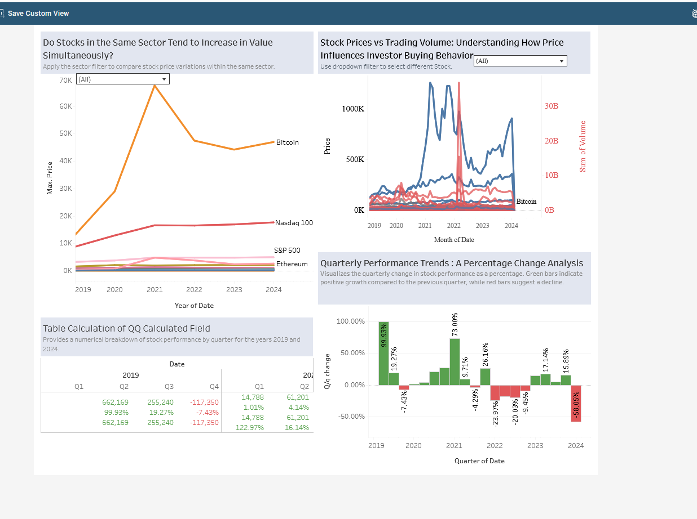

# Stock Market Dashboard Analysis (Tableau)

**Authors:** Justin Mundell

---

## Dashboard Preview

## Overview
This project explores U.S. stock market trends from 2019 to early 2024 using interactive Tableau dashboards. The analysis focuses on sector performance, price trends, trading volume, and the impact of major economic events such as the COVID-19 pandemic. :contentReference[oaicite:0]{index=0}

---

## Objectives
- Analyze stock price trends across sectors  
- Understand the relationship between price and trading volume  
- Evaluate quarter-over-quarter (QoQ) performance  
- Assess the impact of macroeconomic events (e.g., COVID-19)  

---

## Dataset
- U.S. stock market data (2019–2024)  
- Sourced from Yahoo Finance via yfinance  
- Includes:
  - Price (closing)
  - Trading volume
  - Sector classification :contentReference[oaicite:1]{index=1}  

---

## Data Preparation
- Grouped stocks into sectors (technology, energy, metals, crypto, etc.)  
- Cleaned and standardized date formats  
- Transformed data from wide → long format  
- Created calculated fields (QoQ % change, trends)

---

## Dashboards

### 1. Sector Overview
- Visualizes sector distribution and average prices  
- Highlights differences across industries  
- Cryptocurrencies showed the highest average prices in the dataset  

---

### 2. Trends & Performance
- Line charts showing stock trends within sectors  
- Analysis of price vs trading volume relationships  
- QoQ growth metrics with color-coded performance  

---

### 3. Pandemic Impact Analysis
- Tracks stock performance before, during, and after COVID-19  
- Shows market crash (early 2020) and recovery trends  
- Uses reference lines to highlight major economic events  

---

## Key Insights
- Stocks across the same sector tend to move together, with some exceptions (e.g., metals)  
- Trading volume correlates with price momentum and market strength  
- COVID-19 caused a sharp decline followed by strong recovery across most sectors  
- Technology, index funds, and cryptocurrency sectors showed strong long-term growth

---

## Tech Stack
- Tableau  
- Data visualization  
- Time series analysis  
- Calculated fields & dashboard interactivity  

---

## Notes
Future improvements could include:
- Adding open/high/low prices for deeper analysis  
- Implementing candlestick charts  
- Expanding sector coverage for broader economic insight
